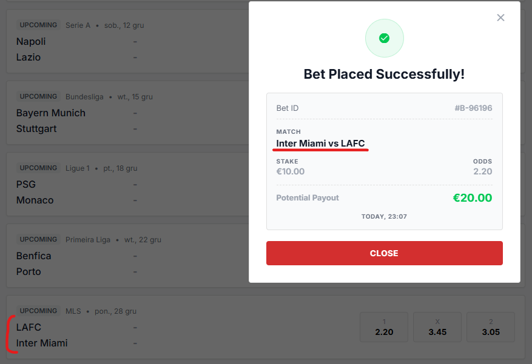
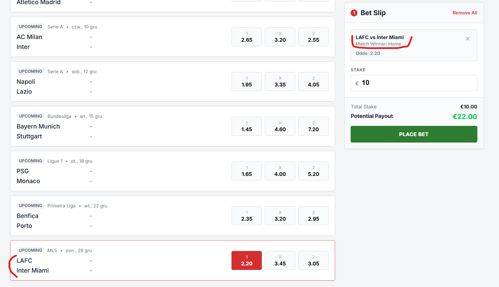
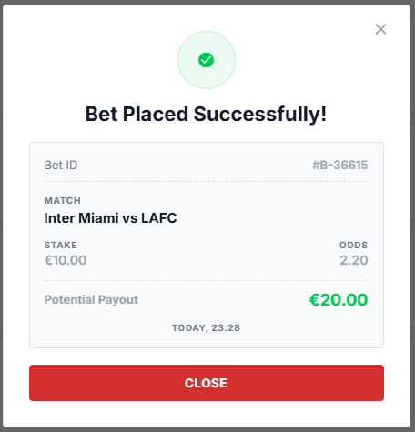
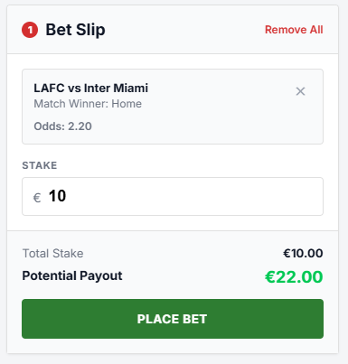
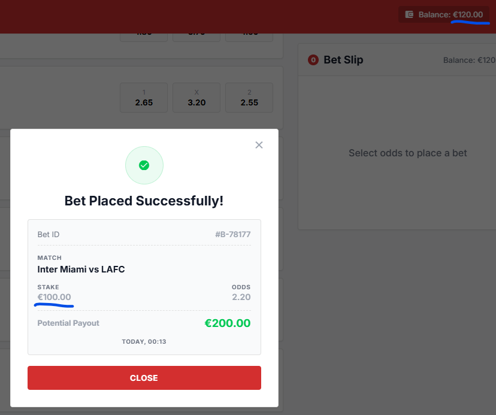
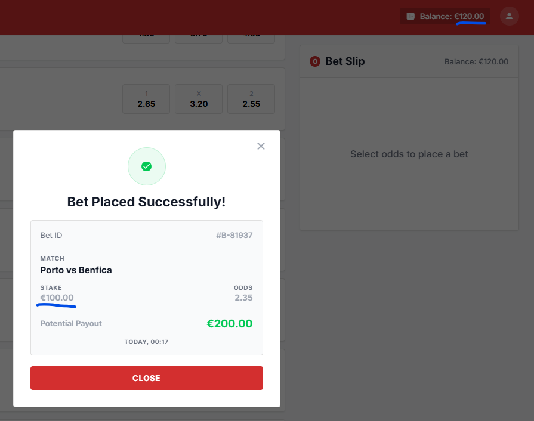
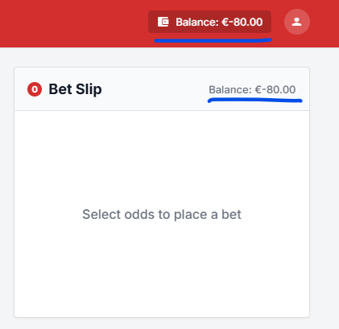
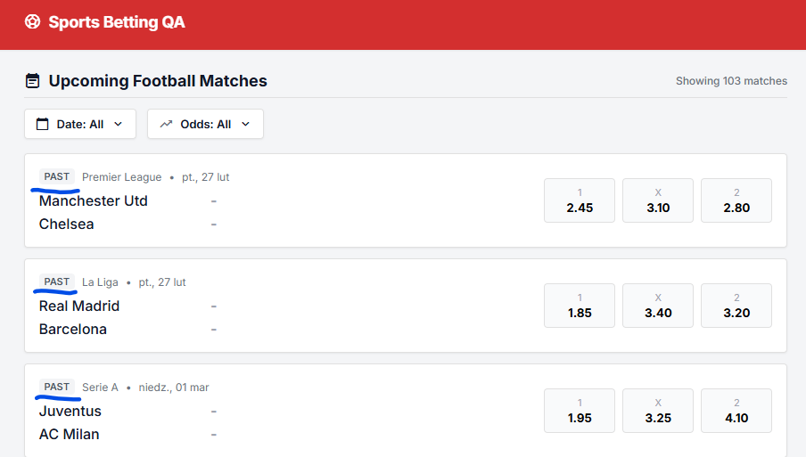
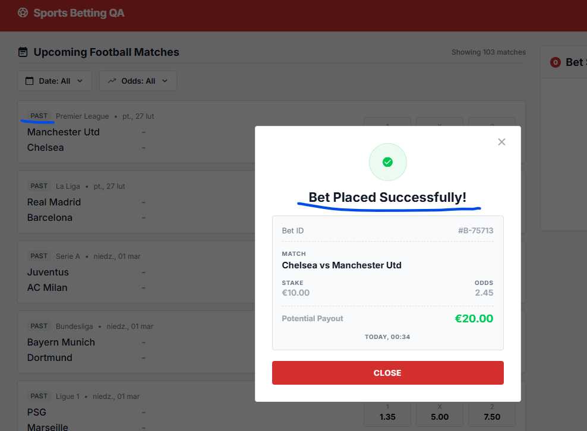

# Execution results
- TEST-01 - Failed; Found bugs: BUG-01, BUG-02, BUG-03
- TEST-02 - Failed; Found bugs: BUG-04
- TEST-03 - Failed; Found bugs: BUG-05


# Found defects

## BUG-01 Team names order has changed after placing the bet

**Severity:**
High

### Reproduction steps
1. Open app: https://qae-assignment-tau.vercel.app/?user-id=<actual-user-id>.
1. Check user initial balance.
1. Find an UPCOMING event and click "1" button.
1. Enter stake value "10.00".
1. Check computed potential payout.
1. Click "PLACE BET" button.

### Expected result
The success receipt modal contains team names in the same order as in the events list and bet slip.

### Actual result
The order of the team names has changed. The home team is displayed as the away team, and vice versa.

### Business Impact
Users can be confused about the bet they have placed. They get misleading information about their placed bet, which may reduce their trust in the platform. It can raise the count of customer support requests.

### Evidence



---

## BUG-02 Missing selection details in receipt modal after placing the bet

**Severity:**
Medium

### Reproduction steps
1. Open app: https://qae-assignment-tau.vercel.app/?user-id=<actual-user-id>.
1. Check user initial balance.
1. Find an UPCOMING event and click "1" button.
1. Enter stake value "10.00".
1. Check computed potential payout.
1. Click "PLACE BET" button.

### Expected result
The success receipt modal contains selection details - Home/Draw/Away

### Actual result
Missing selection details in the success receipt modal.

### Business Impact
Users may be unsure whether the correct bet was placed.

### Evidence


---

## BUG-03 Computed Potential Payout is lower after placing the bet

**Severity:**
High

### Reproduction steps
1. Open app: https://qae-assignment-tau.vercel.app/?user-id=<actual-user-id>.
1. Check user initial balance.
1. Find an UPCOMING event and click "1" button.
1. Enter stake value "10.00".
1. Check computed potential payout.
1. Click "PLACE BET" button.

### Expected result
Potential Payout before and after placing the bet should be the same: €22.00 (stake x odds).

### Actual result
Potential Payout after placing the bet is incorrect.

### Business Impact
Users can decide on placing a bet based on the displayed potential payout. After placing the bet they will see that payout will be lower. Users may lose confidence in the platform and feel misled.

### Evidence



---

## BUG-04 User balance doesn't update and allows placing bets without available funds

**Severity:**
Critical

### Reproduction steps
1. Open app: https://qae-assignment-tau.vercel.app/?user-id=<actual-user-id>.
1. Check user initial balance.
1. Find an UPCOMING event and click "1" button.
1. Enter stake value "100.00".
1. Click "PLACE BET" button.
1. Find another event and click "1" button.
1. Enter stake value "100.00".
1. Click "PLACE BET" button.

### Expected result
Message "Insufficient balance" is visible. "PLACE BET" button is not active.

### Actual result
Balance remains the same. Bets can be placed without available funds.
Balance updates after page refresh.

### Business Impact
Users can place bets without sufficient funds, which may result in financial losses for the company.

### Evidence




---

## BUG-05 Past events are visible in "Upcoming Football Matches" view

**Severity:**
Medium

### Reproduction steps
1. Open app: https://qae-assignment-tau.vercel.app/?user-id=<actual-user-id>.

### Expected result
In the "Upcoming Football Matches" view there are only upcoming events visible.

### Actual result
Past and upcoming events are visible.

### Business Impact
Users can be confused by seeing past events in "Upcoming Football Matches" view.

### Evidence


---

## BUG-06 Users can place bets on past events

**Severity:**
Critical

### Reproduction steps
1. Open app: https://qae-assignment-tau.vercel.app/?user-id=<actual-user-id>.
2. Find any PAST event and click "1" button.
3. Fill stake field with "10" and click "PLACE BET" button.

### Expected result
Bet cannot be placed on an event from the past.

### Actual result
Bet is placed successfully.

### Business Impact
Users can place bets on past events. It can lead to financial losses for the company.

### Evidence


---

## BUG-07 Inconsistent stake minimal value in Feature specification document.

**Severity:**
Low/Medium

### Reproduction steps
1. Open Feature_Specification.pdf document.
2. Compare Business Rules and Validation Rules.

### Expected result
Values in Business Rules -> Stake min and Validation Rules -> Stake Minimum should be the same.

### Actual result
Business Rules -> Stake min == €1.00
Validation Rules -> Stake Minimum == €1.01

### Business Impact
It may cause confusion among developers, testers and business stakeholders. Can lead to incorrect implementation of product and tests.

### Evidence


---

## BUG-08 Placing bets by API allows negative stake values

**Severity:**
Critical

### Reproduction steps
1. Send API POST request with json:
```json
{
  "matchId": "mls-lafc-inter-miami-2026-12-28",
  "selection": "HOME",
  "stake": -1.0
}
```

### Expected result
There should be an error response:
```json
{
  "error": "invalid_stake_min",
  "message": "Stake must be at least 1.00."
}
```
### Actual result
```json
{
  "balance": -1305, 
  "currency": "USD", 
  "matchId": "mls-lafc-inter-miami-2026-12-28", 
  "message": "Bet placed successfully", 
  "odds": 2.2, 
  "payout": -2.21, 
  "selection": "HOME", 
  "stake": -1
}
```

### Business Impact
It violates core business rules. It can lead to invalid bets or financial losses for the company.
It can be exploited by API users.

### Evidence
```
2026-06-14 15:11:49,394 | INFO | root | GET https://qae-assignment-tau.vercel.app/api/matches: 200
2026-06-14 15:11:50,217 | INFO | root | POST https://qae-assignment-tau.vercel.app/api/place-bet: 200

tests\api\test_api.py:11 (TestApi.test_stake_value_range[-1.0-Stake must be at least 1.00.])
'Bet placed successfully' != 'Stake must be at least 1.00.'

Expected :'Stake must be at least 1.00.'
Actual   :'Bet placed successfully'
```
